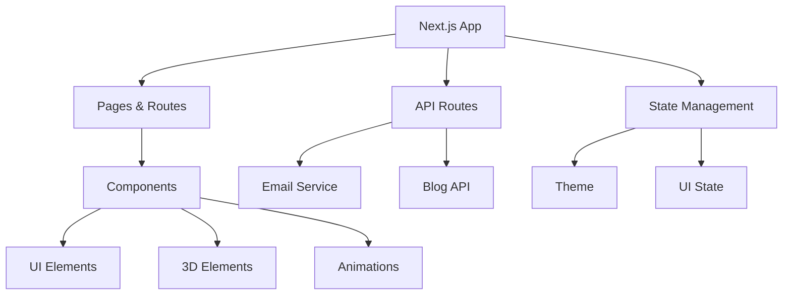

# Rajan Jha - Professional Portfolio 🚀


> A cutting-edge portfolio showcasing innovation through code, creativity, and interactive experiences.

[](https://rajanjha.vercel.app)
## 🎯 Key Features

### 💫 Immersive User Experience
- **Dynamic 3D Hero**: Interactive welcome section with Three.js animations
- **Orbital Skills Display**: Unique skill visualization with interactive orbs
- **Smooth Page Transitions**: Seamless navigation with Framer Motion
- **Responsive Design**: Perfect display across all devices

### 🛠️ Professional Tools
- **Project Showcase**: Interactive cards with live demos
- **Blog Platform**: Share insights with dynamic routing
- **Service Listings**: Showcase your professional offerings
- **WhatsApp Integration**: Direct client communication
## 🎨 Visual Experience


### 🌓 Theme Switching


### 💻 Responsive Design


## 🛠️ Technical Architecture



## 🚀 Getting Started
## 🛠️ Tech Stack

- **Framework**: Next.js 15
- **Language**: TypeScript
- **Styling**: Tailwind CSS
- **3D Graphics**: Three.js, React Three Fiber, React Three Drei
- **UI Components**: Radix UI
- **Animations**: Framer Motion
- **Forms**: React Hook Form with Zod validation
- **State Management**: Zustand
- **Deployment**: Vercel
- **Analytics**: Vercel Analytics

## 📦 Installation

1. Clone the repository:
```bash
git clone https://github.com/your-username/portfolio.git
cd portfolio
```

2. Install dependencies:
## 📂 Project Architecture

```bash
portfolio/
├── 🏛️ app/                # Application Core
│   ├── 🔐 admin/         # Admin Dashboard
│   ├── 🚀 api/          # API Endpoints
│   ├── 📝 blog/         # Blog Section
│   ├── 💼 projects/     # Project Showcase
│   └── 🛠️ services/     # Service Offerings
├── 🧩 components/        # UI Components
│   ├── 🎨 ui/          # Design System
│   └── 🌟 three-js/    # 3D Elements
├── 🎣 hooks/            # Custom Hooks
├── 📚 lib/              # Utilities
└── 🗃️ public/           # Static Assets
```

## 🎨 Component Showcase

### 🌟 Hero Section
The hero section features an interactive 3D scene with dynamic particle effects that respond to user movement.


### 🔮 Skills Orbital
A unique 3D visualization of technical skills using Three.js orbital mechanics.


### 💼 Project Cards
Elegant project displays with hover effects and detailed information.


### ⏳ Experience Timeline
A beautiful chronological display of professional experience.


## 🌐 Browser Support

| Chrome | Firefox | Edge | Safari | Opera |
|:------:|:-------:|:----:|:------:|:-----:|
|    ✅   |    ✅    |   ✅  |    ✅   |   ✅   |

## 🤝 Contributingve at:

**[https://vercel.com/rajanjha114430-gmailcoms-projects/v0-rajanjha-ey](https://vercel.com/rajanjha114430-gmailcoms-projects/v0-rajanjha-ey)**

## 📁 Project Structure

```
portfolio/
├── app/                    # Next.js app directory
│   ├── admin/             # Admin panel
│   ├── api/               # API routes
│   ├── blog/              # Blog pages
│   ├── projects/          # Projects showcase
│   └── services/          # Services pages
├── components/            # Reusable components
│   ├── ui/               # UI components
│   └── three-js/         # 3D components
├── hooks/                # Custom React hooks
├── lib/                  # Utility functions
└── public/               # Static assets
```

## 🎨 Components

- **Hero Section**: Interactive 3D hero with particle effects
- **Skills Section**: Orbital display of technical skills
- **Projects**: Grid layout with project cards
- **Experience Timeline**: Chronological experience display
- **Contact Form**: Integrated email service
- **Blog**: Dynamic blog with markdown support

## 🤝 Contributing

1. Fork the repository
2. Create a feature branch (`git checkout -b feature/amazing-feature`)
3. Commit your changes (`git commit -m 'Add some amazing feature'`)
4. Push to the branch (`git push origin feature/amazing-feature`)
5. Open a Pull Request

## 📄 License

This project is licensed under the MIT License - see the [LICENSE](LICENSE) file for details.

## 📞 Contact

Rajan Jha - [Your Email]

Project Link: [https://github.com/Rajan167030/portfolio](https://github.com/Rajan167030/portfolio)

## How It Works


---

Built by Rajan Jha
